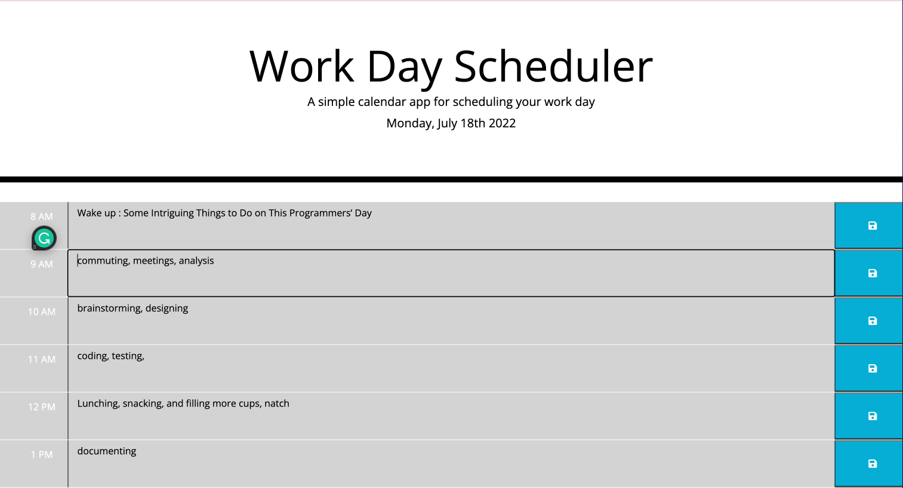

# Work-Day-Scheduler-APP

## Description

A simple calendar application that allows a user to save events for each hour of the day. This app will run in the browser and feature dynamically updated HTML and CSS powered by jQuery.

Deployed app: https://github.com/kaihuan-huang/Work-Day-Scheduler-APP

Gitpage:  https://kaihuan-huang.github.io/Work-Day-Scheduler-APP/

- The starter code uses the Moment.js (Links to an external site.) library to work with date and time；

- Managing my time effectively by adding important events to a daily planner;

- Current day is displayed at the top of the calendar;

- Presenting with time blocks for standard business hours;

- Each time block is color-coded to indicate grey is in the past, red-color: present, or green-color: future

- Clicking the save button for that time block, the text for that event is saved in local storage;

- Refreshing the page then the saved events persist.

Mock-up

## Screenshots

The following images demonstrate the web application's appearance:

---